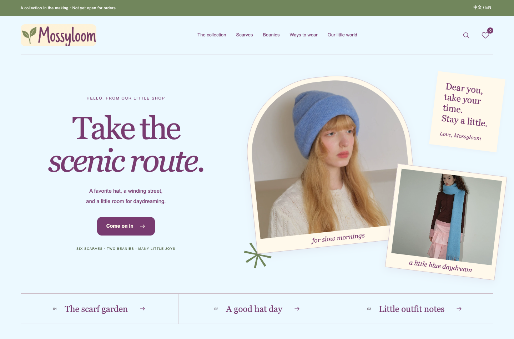

# Mossyloom · The Little Stroll

A knitwear collection preview in sky blue, cream and plum. The fourth design is now the only storefront, with six scarves, two beanies and 51 real supplier photographs.

**[Open the collection preview](https://violetloveai.github.io/mossyloom-preview/)**



## What works

- Browse eight product styles, search by name, pattern or visual color, filter by category, and sort by name.
- View each product’s photo gallery and enlarge individual images.
- Save up to eight styles in your browser. Copy or download the list, or return to it later in the same browser.
- Explore outfit ideas and switch between English and Chinese.
- Read the current launch status, delivery information and privacy notice.

Saved pieces are not orders, stock reservations or messages to the shop. The preview has no customer accounts, checkout, payment processing, email subscriptions or customer database. It does not collect passwords, delivery addresses or card information. Earlier demo prices, reviews, stock, coupons and payment simulations have been removed.

The first collection is still being prepared. Material composition, measurements, final color options, retail prices, stock and commercial image rights need confirmation before sales can start. Photo colors are visual references, not selectable inventory. See the [image record](ASSET-SOURCES.md).

## Run locally

With Python 3 installed, no additional dependencies or build step are needed.

```sh
git clone https://github.com/violetloveAI/mossyloom-preview.git
cd mossyloom-preview
python3 -m http.server 4173 --bind 127.0.0.1
```

Open `http://127.0.0.1:4173/`. Use an HTTP server rather than opening `index.html` as a local file, because the app loads its catalog and JavaScript modules over HTTP.

## Files

| Path | Purpose |
| --- | --- |
| `index.html` | App entry, metadata and local stylesheets |
| `js/app.js` | Navigation, language, collection filters and editorial pages |
| `js/collection.js` | Product galleries and saved style lists in browser storage |
| `styles.css`, `collection.css` | Responsive storefront and product layouts |
| `data/catalog.json` | Eight product styles and bilingual descriptions |
| `assets/products/` | Local product photographs and thumbnails |
| `data/image-provenance.json` | Photo sources and hashes |

Relative asset paths and hash routes work below a repository path. Old `?style=1` through `?style=4` links open the chosen design. Removed product and shopping routes explain the change and link back to the collection.

The site uses no external runtime scripts, web fonts, analytics or advertising pixels. Language and saved product IDs use local storage when available. The privacy page can clear Mossyloom data, including data left by the previous demo. GitHub may retain its normal hosting logs.

## Hosting and launch boundary

GitHub Pages hosts this design preview. [GitHub’s Pages limits](https://docs.github.com/en/pages/getting-started-with-github-pages/github-pages-limits) prohibit using the service as free hosting for an online business or e-commerce site. A commercial launch needs suitable hosting, a real commerce backend, a supported merchant/payment account, approved product information, prices, stock and service policies. Merely hiding checkout is not a substitute for meeting a host’s terms.

Search indexing remains disabled for this review version. The private owner questionnaire, procurement costs and shipping calculations are kept outside this public repository. The previous four-design demo remains recoverable in Git history.

## Verification

Browser checks cover desktop and mobile navigation, English/Chinese switching, search and category filtering, all eight product galleries, saved-list persistence and exports, missing pages, and retired shopping routes. The collection stores only product identifiers; it never turns a saved list into a paid order.

This repository does not grant an open-source or asset reuse license. Supplier-photo permission has been recorded for the public demonstration; commercial reuse is a separate launch requirement.
